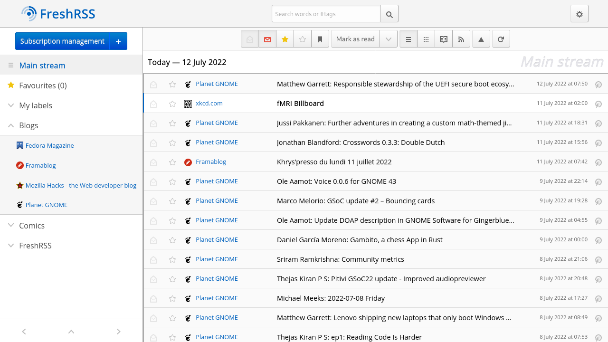

# Home Assistant Add-on: FreshRSS

A free, self-hostable feed aggregator.

## About

FreshRSS is a self-hosted RSS and Atom feed aggregator.
It is lightweight, easy to work with, powerful, and customizable.

